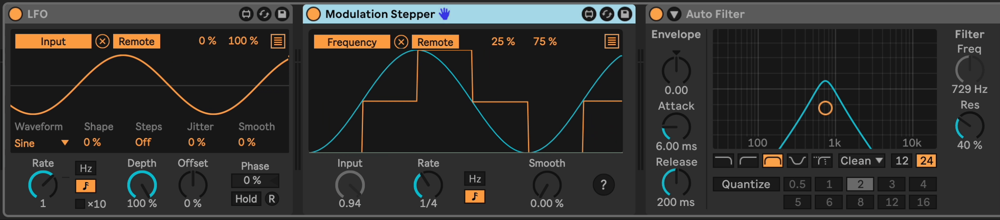

# Modulation Stepper

This is a Max For Live device that will turn continuous modulation input into stair-stepped output. It's similar to what a bitcrusher does to audio.

For example, you can map an LFO outputting a sine wave to this device's input, then configure the device to generate steps at a tempo-synced or free time interval, automating up to 8 other parameters.

Here is an image Modulation Stepper turning a sine wave into 1/8 note steps. The
blue line is the input signal and the orange line is the output signal.

## Installation

[Download the .amxd file from the latest release](https://github.com/zsteinkamp/m4l-Modulation-Stepper/releases) or clone this repository, and drag the `AutomationStepper.amxd` device into a track in Ableton Live.

## Changelog

* 2024-08-17 [v3](https://github.com/zsteinkamp/m4l-Modulation-Stepper/raw/main/frozen/Modulation%20Stepper%20v3.amxd) - Live 12 modulation support; Visual and CPU improvements.
* 2022-12-05 [v2](https://github.com/zsteinkamp/m4l-Modulation-Stepper/raw/main/frozen/Modulation%20Stepper%20v2.amxd) - Rename to Modulation Stepper; Use integer version numbers.
* 2022-04-08 [0.0.1](https://github.com/zsteinkamp/m4l-AutomationStepper/raw/main/frozen/AutomationStepper-0.0.1.amxd) - Initial release.

## Usage

Usually, you would map a MIDI controller or modulation source to `Input`. Then choose a step frequency (either in Hz or in note values). You can adjust the smoothing to create a portamento-like effect as the step moves from one value to another.

Use the "Map" button to map the stepped output to another parameter. Click the `[=]` button in the upper left to reveal additional modulation destination slots.

## TODO

* ...

## Contributing

I'd love it if others extended this device. If you would like to contribute, simply fork this repo, make your changes, and open a pull request and I'll have a look.

## More

I have many other free and open-source devices available. Visit https://steinkamp.us/music-tools/ to see them all.
